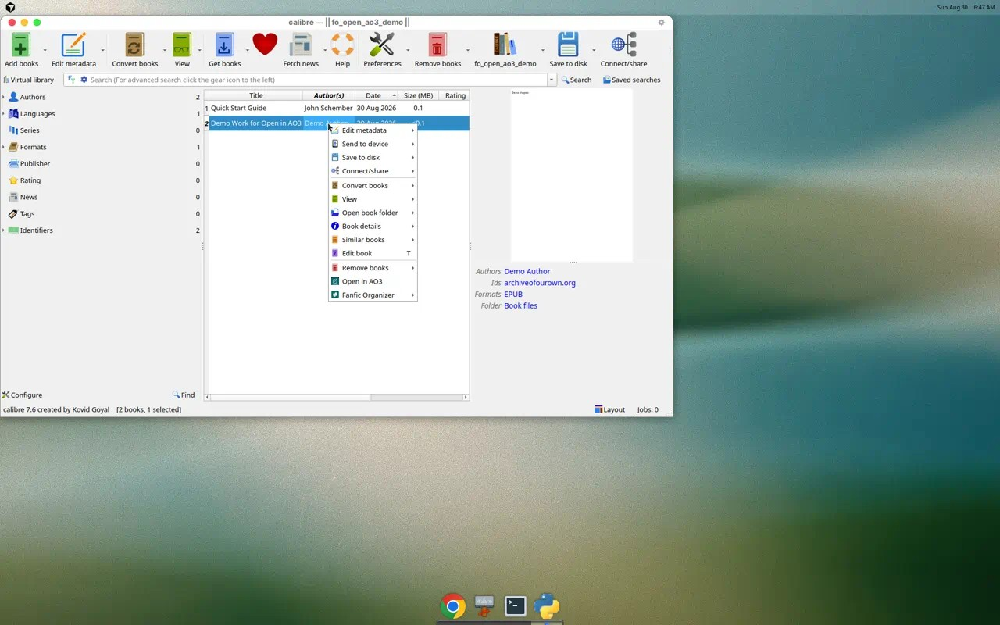
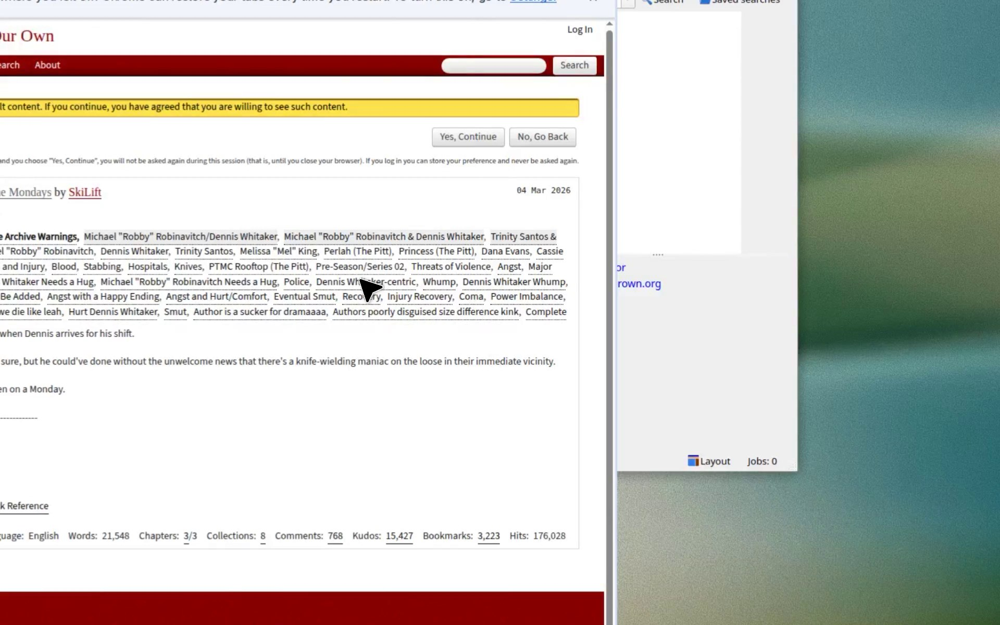
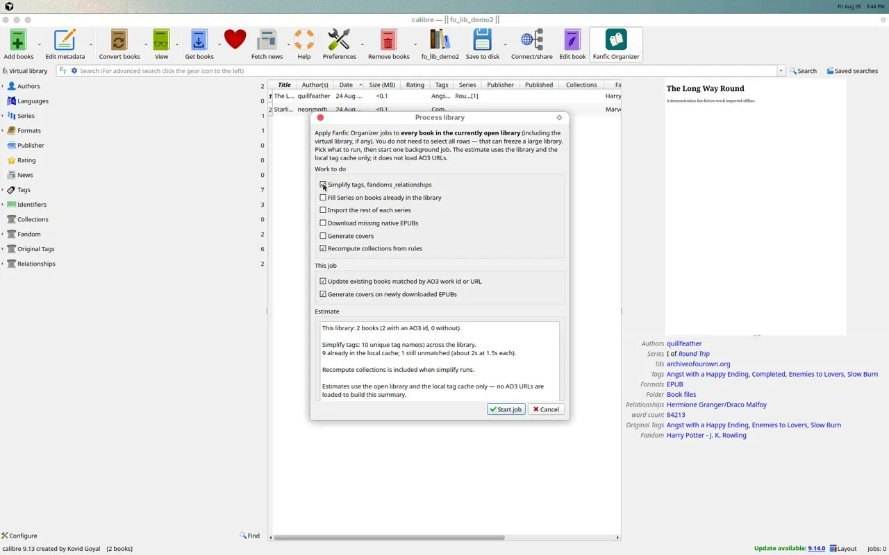
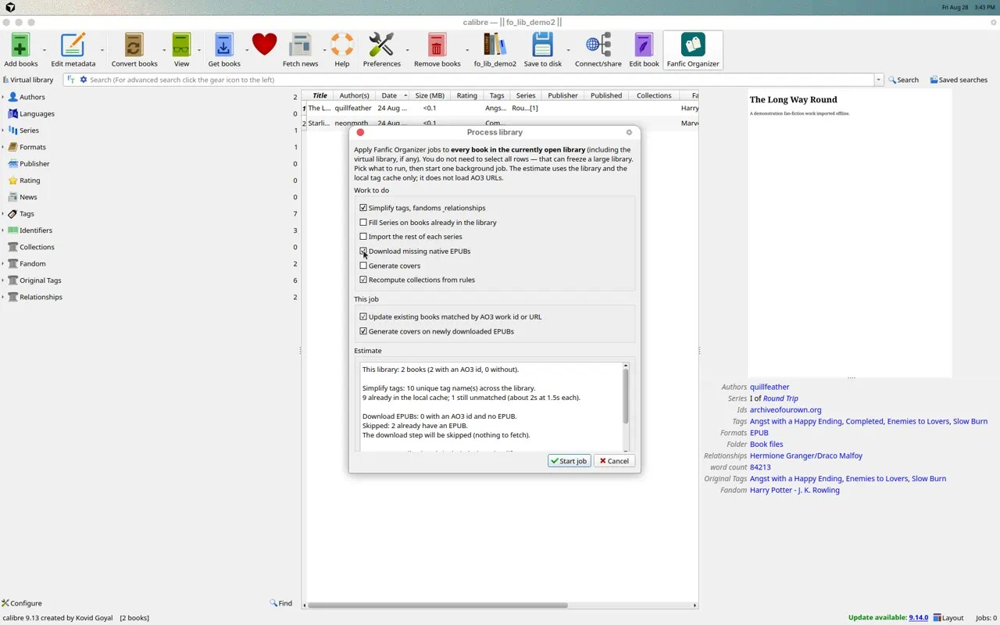
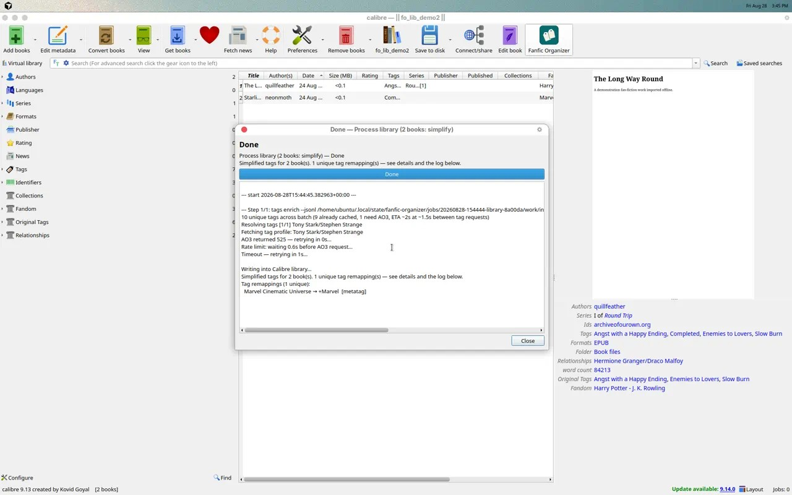
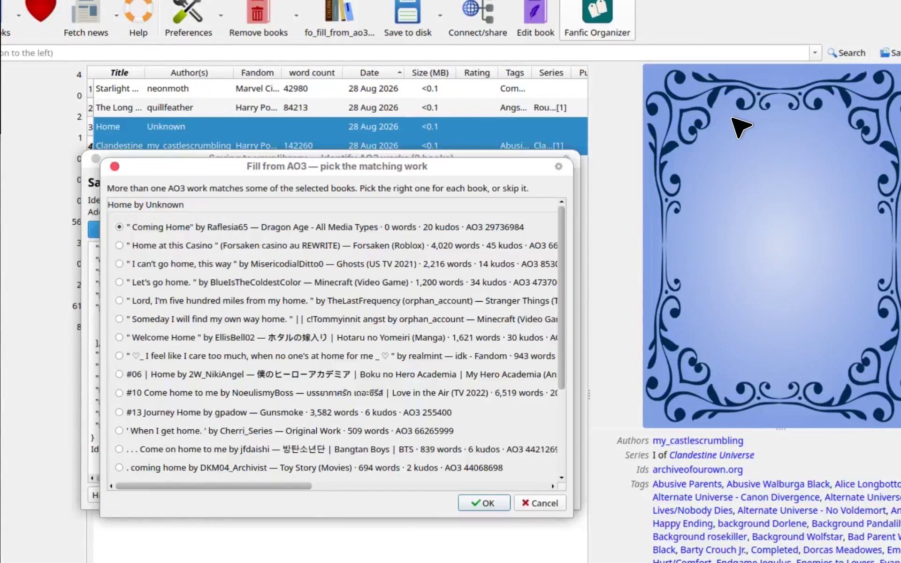
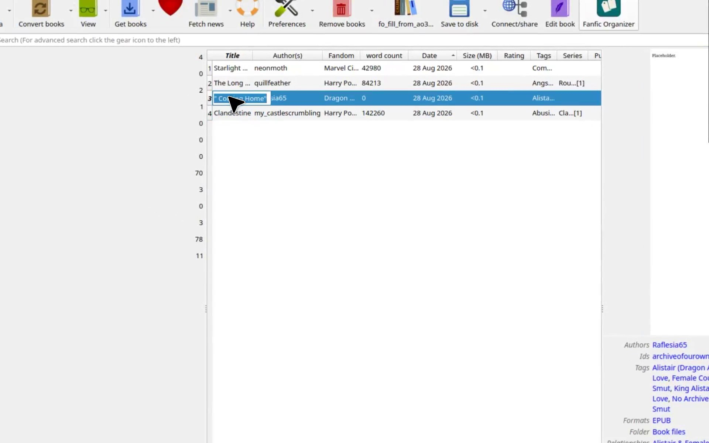

# Feature showcase

Demos of Fanfic Organizer in Calibre. The plugin is the product; these files are recordings of the real UI, not mockups.

## Open in AO3

Library right-click → **Open in AO3** (top-level, with icon) opens the selected book’s AO3 works page in the browser from its `ao3` / `url` identifiers.[^open-in-ao3]

After **Open in AO3**, the browser goes to that work’s AO3 page:

[Screen recording](open-in-ao3-context-menu.mp4) (right-click → Open in AO3 → browser).

## Process library

**Process library…** (plugin menu, no selection) runs simplify, series, EPUB download, covers, and/or collection recompute on the **whole open library**. Use it instead of Select All on a large library.[^process-library]

The dialog shows a local estimate first (library fields + tag cache; no AO3 URLs): unique vs unmatched tags, missing EPUBs, incomplete series metadata, and a duration hint.

Checking **Download missing native EPUBs** updates the estimate. Here both books already have files, so the download step would be skipped:

Start job runs the same background path as the selected-book actions. A simplify-only run on two books:

[Screen recording](process-library-dialog-and-simplify.mp4) (menu → Process library → toggle estimates → simplify-only job).

## Fill from AO3[^recorded]

**Selected books → Fill from AO3** identifies works already in the library, then fills missing AO3 metadata (and native EPUBs when that setting is on).

Identify order: AO3 id or URL on the book → URL inside the EPUB → title + author search. Unique hits fill immediately. Several matches open a picker in the same run:

Here **Home** (title only, author Unknown) matched many AO3 works. The first candidate is selected; **Skip this book** leaves that row unchanged.

After **OK**, Fill writes identifiers, Fandom, tags, and the rest onto those rows. Title-only **Home** became **Coming Home** with the chosen work’s metadata:

[Screen recording](fill-from-ao3-identify-and-picker.mp4) (select two books → Fill from AO3 → picker → filled library).

[^process-library]: Recorded 28 August 2026 on the Process library branch (unreleased). Later releases may look different.
[^recorded]: Recorded 28 August 2026 against Fanfic Organizer [0.31.0](https://github.com/BlakeASmith/fanfic-organizer/releases/tag/v0.31.0). Later releases may look different.
[^open-in-ao3]: Recorded 30 August 2026 on the Open in AO3 branch (unreleased). Later releases may look different.
